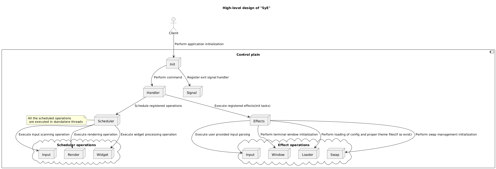

# SyE

[](https://github.com/YarikRevich/SyE/actions/workflows/build.yml)


[](https://github.com/vshymanskyy/StandWithUkraine/blob/main/docs/README.md)


## General Information

Minimalistic **CLI** editor, with the custom programming language based themes and widgets feature support.



## Setup

All setup related operations are processed via **Makefile** placed in the root directory.

In order to build SyE binary it's required to execute the following command. 

```shell
make build
```

After the execution of command given above the executable will be generated and placed into **bin** folder in the root directory of the project.

## Use cases